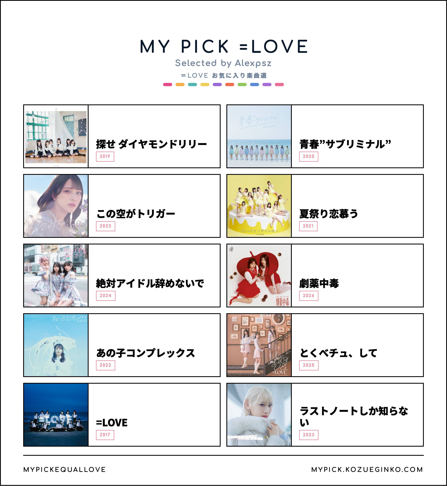

# MyPick Sister Projects

[MyPickEqualLove](https://mypick.kozueginko.com)

Single-codebase fan tools for building shareable top-pick song boards.

This repository currently supports three sister sites from the same `main` branch:

- `equal-love`: MyPickEqualLove
- `nearly-equal-joy`: MyPickNearlyEqualJoy
- `not-equal-me`: MyPickNotEqualMe

The React UI, search, local storage, image export, and share flows are shared. Project-specific brand text, colors, site URLs, members, songs, and icons live under `src/projects/`.



---

## Getting Started

### Prerequisites

Use Node.js 20.9 or newer.

### Installation

```bash
git clone https://github.com/alexpsz/MyPickEqualLove.git
cd MyPickEqualLove
npm install
```

### Development

```bash
npm run dev:equal-love
npm run dev:nearly-equal-joy
npm run dev:not-equal-me
```

Open [http://localhost:3000](http://localhost:3000).

Development scripts run Next dev with webpack because Turbopack dev can hang on the first homepage compile in this project on Next.js 16.2.x. Production builds still use the normal static export path.

### Build

```bash
npm run build:equal-love
npm run build:nearly-equal-joy
npm run build:not-equal-me
```

Each build writes a static export to `out/`.

---

## Cloudflare Pages

Use three Cloudflare Pages projects connected to the same GitHub repo and `main` branch.

| Site | Build command | Output |
| --- | --- | --- |
| MyPickEqualLove | `npm run build:equal-love` | `out` |
| MyPickNearlyEqualJoy | `npm run build:nearly-equal-joy` | `out` |
| MyPickNotEqualMe | `npm run build:not-equal-me` | `out` |

The build scripts set `NEXT_PUBLIC_PROJECT_ID` to select the correct project. Keep `mypick.kozueginko.com` assigned to `equal-love`; use new Pages projects or custom domains for the other two sites.

---

## Data

Project data lives in:

```text
src/projects/equal-love/
src/projects/nearly-equal-joy/
src/projects/not-equal-me/
```

Each project has `members.json` and `songs.json`. Cover images should stay under matching public paths such as `/covers/equal-love/...`, `/covers/nearly-equal-joy/...`, and `/covers/not-equal-me/...`.

Validate all project data:

```bash
npm run validate:data
```

Validate one project:

```bash
npm run validate:data:project -- equal-love
```

---

## Tech Stack

- **Framework**: [Next.js](https://nextjs.org/) App Router with static export
- **Language**: [TypeScript](https://www.typescriptlang.org/)
- **Styling**: [Tailwind CSS](https://tailwindcss.com/)
- **Canvas Export**: [html2canvas](https://html2canvas.hertzen.com/)

---

## License

This project is adapted from [rurimegu/MyPickHasunosora](https://github.com/rurimegu/MyPickHasunosora), which is licensed under the MIT License.

## Disclaimer

This is an unofficial fan-made project. Group names, song titles, images, and related marks belong to their respective rights holders.
