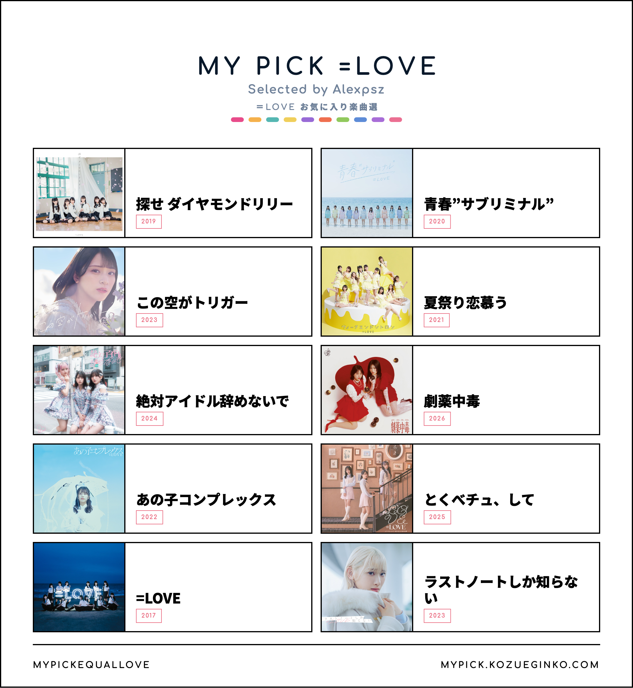
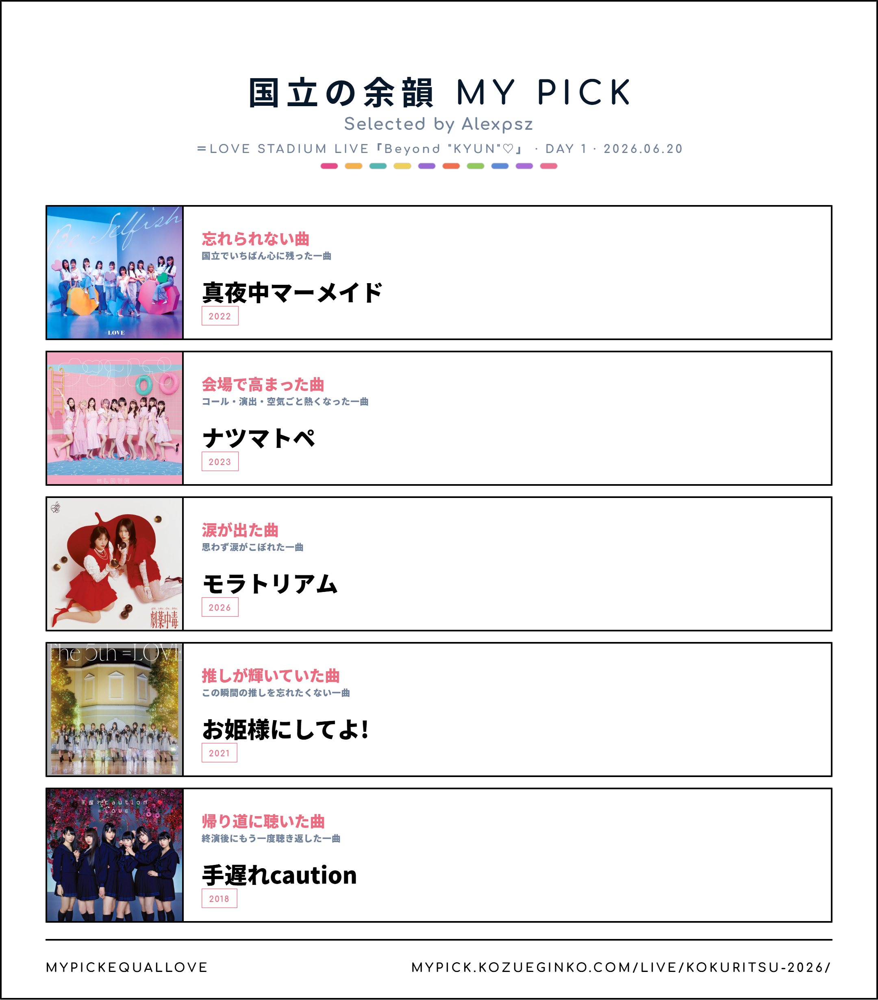

# MyPick Sister Projects

Fan-made static web apps for creating shareable Top 10 song boards for =LOVE, ≒JOY, and ≠ME.

[MyPickEqualLove](https://mypick.kozueginko.com) · [MyPickNearlyEqualJoy](https://mypick-nearly-equal-joy.kozueginko.com) · [MyPickNotEqualMe](https://mypick-not-equal-me.kozueginko.com)



## Features

- Pick a Top 10 with search, filters, permanent song pages, and reviewed official
  media links.
- Listen to reviewed 30-second Apple Music previews directly from search and
  song details.
- Save, reorder, restore, share, and compare boards locally in the browser.
- Use Pick Assistant, factual Top 10 overviews, new-song notices, and quick
  commands.
- Follow the system theme or choose light or dark mode, and install each site.
- Export four PNG styles with optional QR codes for download or sharing.
- Build three sister sites from one shared codebase.

## Privacy and previews

MyPick does not run its own server or collect information. When you press play,
your browser requests a 30-second audio file from Apple's content delivery
network. No preview request is made before you press play.

## Live Specials

- =LOVE now has event-specific six-pick pages alongside the standard Top 10 picker.
- `/live/kokuritsu-2026/` creates a Kokuritsu 2026 afterglow board with `DAY 1`, `DAY 2`, and `2 DAYS` contexts.
- `/live/tokyo-dome-2027/` creates a Tokyo Dome 2027 wishlist board.
- Live specials use their own saved picks, PNG export layout, filenames, and share text.



## MyPick Archetype

=LOVE's standard Top 10 includes an optional entertainment preview that pairs a
completed board with a character from the 21st single's MV world. It runs
entirely in the browser, sends no user information to a server, and does not save
the result or change the board.

## Projects

| Project ID         | Site                 | Build command                    |
| ------------------ | -------------------- | -------------------------------- |
| `equal-love`       | MyPickEqualLove      | `npm run build:equal-love`       |
| `nearly-equal-joy` | MyPickNearlyEqualJoy | `npm run build:nearly-equal-joy` |
| `not-equal-me`     | MyPickNotEqualMe     | `npm run build:not-equal-me`     |

Each build writes a static export to `out/`.

To preview the most recently built static export locally:

```bash
npm run build:equal-love
npm start
```

`npm run verify` runs the repository boundary, lint, type check, data and
contract tests, then builds and verifies all three static exports in sequence.

## Local Development

Requires Node.js 20.9 or newer; `.node-version` selects Node.js 22 for local and Cloudflare builds that support it.

```bash
npm install
npm run dev:equal-love
```

Other local targets:

```bash
npm run dev:nearly-equal-joy
npm run dev:not-equal-me
```

Open [http://localhost:3000](http://localhost:3000).

## Data

Song and member catalogs are stored as static JSON in
`src/projects/<project-id>/`; cover images are in
`public/covers/<project-id>/`.

```bash
python -m pip install -r requirements-discography.txt
npm run sync:data:all
npm run validate:data
```

Use `npm run sync:songs:all` to refresh song catalogs only.

## Stack

Next.js App Router, React, TypeScript, Tailwind CSS, and `html2canvas`.

## License

This project is adapted from [rurimegu/MyPickHasunosora](https://github.com/rurimegu/MyPickHasunosora), which is licensed under the MIT License.

## Disclaimer

This is an unofficial fan-made project. Group names, song titles, images, and related marks belong to their respective rights holders.
